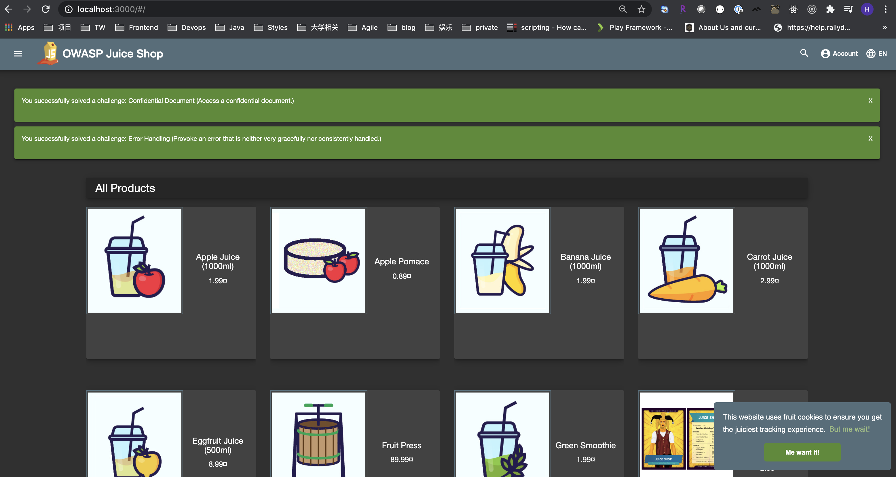
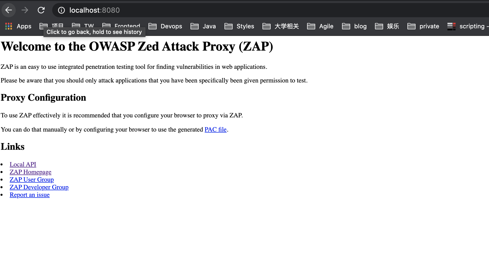
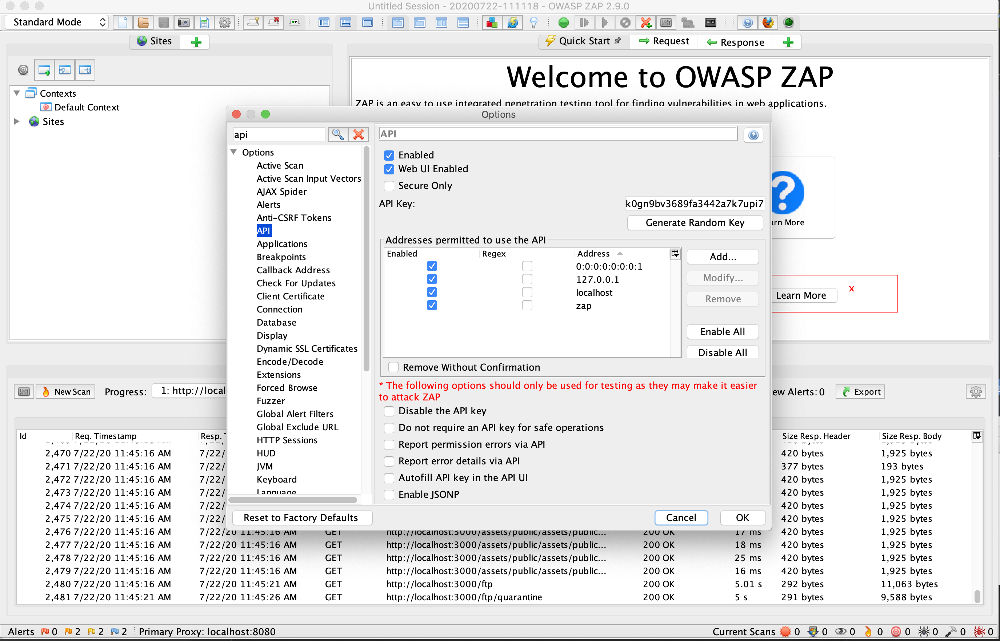
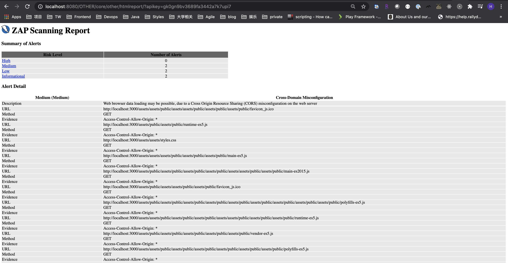

## Zap example, learn how to active scan the target application to find the security vulnerability, generating security report

### How to generate this project
```node.js
npm init esm --yes
npm install zaproxy
```

### Before running this project
1. download and start juice-shop(https://github.com/bkimminich/juice-shop#from-sources), following readme file
2. start the juice-shop(localhost:3000)



3. download zap(https://www.zaproxy.org/download/) and install zap
4. visit http://localhost:8080/ to verify that zap install successfully


5. get the zap api key



6. replace the index.js file api-key

### Start zap scanning

```
npm test
``` 

### generate html report

visit http://localhost:8080/UI/core/other/htmlreport/, then input api-key to see the report

